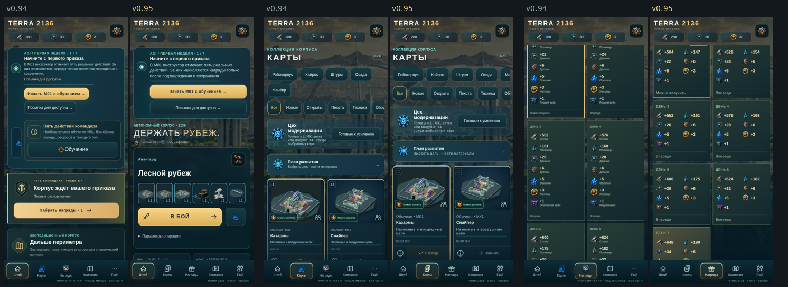

<div align="center">

# ⚔️ TERRA 2136
## DESERT STRYKE

### Марс не ждёт. Построй оборону.

<p>
  
</p>

<p>
  <a href="./index.html"></a>
  <a href="./TERRA2136_PLAY_v0.95.0.html"></a>
</p>

<p>
  
  
  
  
</p>

> **Tower offense / RTS для браузера.**
> Собери линию. Выпусти отряд. Удержи сектор.

</div>

---

## ☢️ Ситуация на фронте

Год `2136`. Марсианская пустыня стала полем последнего конфликта.

Ты командуешь обороной: строишь посты, контролируешь линии атаки, запускаешь боевые отряды и собираешь ресурсы для следующего прорыва. Здесь нет серверов, ожидания и внешних загрузок — только ты, тактическая карта и один большой автономный HTML-файл.

**TERRA 2136 — это не “ещё одна демка”. Это playable-вселенная, собранная вокруг ощущения настоящего командного центра.**

---

## 🔥 Что тебя ждёт

<table>
<tr>
<td width="33%" valign="top">

### 🛰️ FRONTLINE

Тактический бой в реальном времени. Строй посты, открывай линии атаки, управляй поддержкой и держи рубеж.

</td>
<td width="33%" valign="top">

### 🗺️ CAMPAIGN

50 операций, карта-коллекция, ангар, модули, улучшения и награды за продвижение.

</td>
<td width="33%" valign="top">

### ⚙️ OFFLINE CORE

Одна сборка. WebGL2. Встроенные ассеты. Никаких CDN, сетевых запросов и обязательной установки.

</td>
</tr>
</table>

---

## 🎮 Запуск за 30 секунд

### Вариант 1 — просто открыть

1. Нажми [`index.html`](./index.html).
2. Запусти операцию.
3. Если хочешь сразу в бой — открой [`TERRA2136_PLAY_v0.95.0.html`](./TERRA2136_PLAY_v0.95.0.html).

Игра работает локально в браузере, а прогресс сохраняется на устройстве.

### Вариант 2 — через локальный сервер

```bash
python3 -m http.server 8000
```

Открой <http://localhost:8000/>.

---

## 🧪 Это портфолио, а не только игра

Проект показывает полный цикл создания браузерного game prototype:

- самостоятельный HTML runtime без фреймворка;
- разделённые исходники и обратная сборка в единый файл;
- WebGL2-рендеринг и встроенные визуальные ассеты;
- детерминированная симуляция с фиксированным шагом 20 Гц;
- локальный прогресс, транзакции кошелька и совместимые сохранения;
- адаптивный интерфейс под мобильные и desktop-разрешения;
- автоматический UI lint и battle smoke test через Playwright.

> **Цель проекта:** сделать игру, которую можно открыть одним кликом, и кодовую базу, которую можно разобрать по слоям.

---

## 🧬 Как устроена машина

```text
parts/
├── markup/       каркас меню, боя и модалок
├── css/          визуальная система и слои UI-полировки
├── ui/           навигация, экраны, HUD и ввод
├── game/         симуляция, кампания и прогресс
├── render/       WebGL-рендер и визуальные эффекты
├── engine/       игровой runtime
└── data/         баланс, конфиги и встроенные ассеты

pipeline:
parts/ → tools/build.py → один playable HTML → браузер → qa/qa.py
```

| Слой | Главная роль |
|---|---|
| `game/content-sim.js` | правила боя, кампания и детерминированная симуляция |
| `game/progress.js` | кошелёк, награды, сохранения и экспорт |
| `ui/controller.js` | меню, бой, HUD и пользовательский ввод |
| `render/` + `engine/` | визуальный runtime и WebGL2-эффекты |
| `tools/build.py` | сборка всех частей в готовую игру |
| `qa/qa.py` | проверка интерфейса и короткий прогон боя |

---

## 🛠️ Build the battlefield

### Требования

- Python `3.11+`
- Node.js `20+`
- Git
- Playwright + Chromium — только для QA

### Собрать игру

```bash
python3 tools/build.py parts/ dist/TERRA2136_PLAY.html
```

### Проверить JavaScript

```bash
python3 tools/check.py dist/TERRA2136_PLAY.html
```

### Установить Playwright и прогнать QA

```bash
python3 -m pip install playwright
python3 -m playwright install chromium

python3 qa/qa.py dist/TERRA2136_PLAY.html --out qa-out --no-battle
python3 qa/qa.py dist/TERRA2136_PLAY.html --out qa-out --battle-only --viewports mobile
```

QA следит за ошибками страницы и консоли, битыми изображениями, горизонтальным overflow, маленькими touch-target, слишком мелким текстом, стабильностью combat dock и установкой постройки.

Финальная строка проверки:

```text
QA RESULT: PASS
```

---

## 📡 Правила выживания кода

- Редактируй `parts/`, не готовый HTML.
- После каждой правки: `build → check → qa`.
- Новые UI-правила добавляй в последний слой `css/10-polish95.css`.
- Не ломай фиксированный шаг симуляции и разделение `game` / `render-only`.
- Прогресс меняется только через транзакции `TerraProgress`.
- Не добавляй внешние шрифты, CDN, сетевые запросы или незашитые ассеты.
- Баланс документируй в [`docs/CHANGELOG.md`](./docs/CHANGELOG.md).

Подробные инварианты: [`CLAUDE.md`](./CLAUDE.md).

---

## 🚧 Арсенал разработки

| Версия | Сектор | Состояние |
|---|---|---|
| `0.95.0` | штаб, иконки, порядок UX, читаемость | ✅ deployed |
| `0.96.0` | HUD боя | 🛠️ next target |
| `0.97.0` | награды R1–R4 | 🗺️ planned |
| `0.98.0` | визуал карт и моделей | 🗺️ planned |
| `1.0.0` | финальный релиз | 🎯 target |

Полный маршрут: [`docs/ROADMAP.md`](./docs/ROADMAP.md).

---

## 📚 Досье проекта

- [`docs/ROADMAP.md`](./docs/ROADMAP.md) — куда движется TERRA 2136
- [`docs/CHANGELOG.md`](./docs/CHANGELOG.md) — что уже изменилось
- [`docs/AUDIT.md`](./docs/AUDIT.md) — технический и UX-аудит
- [`docs/REWARDS_REVIEW.md`](./docs/REWARDS_REVIEW.md) — экономика и система наград
- [`docs/RESEARCH_NOTES.md`](./docs/RESEARCH_NOTES.md) — исследовательские заметки
- [`patches/`](./patches/) — воспроизводимые версионные патчи

---

<div align="center">

### Нужен ещё один сектор?

[**▶ ОТКРЫТЬ ИГРУ**](./index.html) · [**🗺 ПОСМОТРЕТЬ ROADMAP**](./docs/ROADMAP.md) · [**⚙ ИЗУЧИТЬ CODEBASE**](./parts/)

<br>

`MADE FOR MARS` · `BUILT FOR PLAY` · `ENGINEERED FOR OFFLINE`

<br>

<strong>TERRA 2136 · DESERT STRYKE</strong>

</div>
