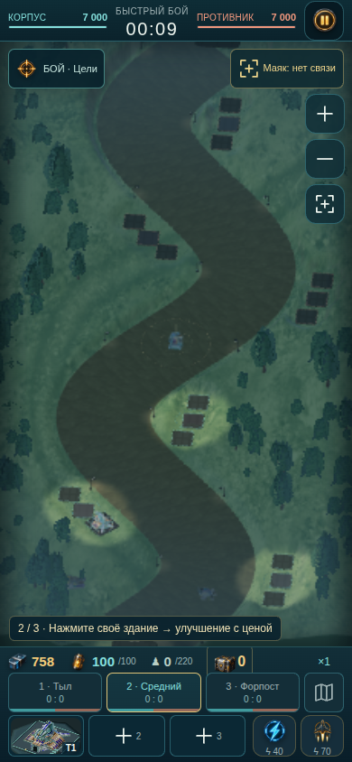
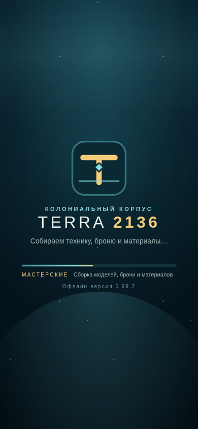

<div align="right">

[🇷🇺 Русская версия](./README.ru.md) · [🇬🇧 English version](./README.md)




<sub>Слева — операция на экране 390 px. Справа — запуск игры.</sub>

</div>

<div align="center">

# TERRA 2136 • Desert Stryke

### Марс не будет ждать. Построй оборону, переживи волну и вернись сильнее.

<p><strong>Офлайн-браузерная тактическая RTS / tower offense в одном HTML-файле.</strong></p>

<p>
  <a href="./index.html">▶ Играть сейчас</a> ·
  <a href="./TERRA2136_PLAY_v0.99.2.html">⬇ Игровая сборка v0.99.0</a> ·
  <a href="./docs/ROADMAP.md">🗺 Дорожная карта</a>
</p>

</div>

---

## Что это за игра

**TERRA 2136 — Desert Stryke** — компактная тактическая стратегия о враждебном марсианском фронтире. В игре есть бой в реальном времени на стыке tower defense и RTS, кампании и миссии, улучшения, награды, локальная прогрессия, адаптивный mobile-first интерфейс и WebGL2-рендеринг.

Игровая версия поставляется одним автономным HTML-файлом: сервер, аккаунт, CDN и подключение к интернету не нужны.

## Актуальная версия: v0.99.0

В текущей сборке доступны:

- **HUD боя 0.96.0:** в проверенных разрешениях нет текста меньше 10 px, цели касания не меньше 44 px, а первый бой ведёт по трём шагам: стройка → улучшение → поддержка.
- **Модели юнитов 0.97.x:** выбор детализации по размеру на экране, анизотропная фильтрация до 8×, наклон от ускорения и уклона, крен в повороте и масштабирование текстур под устройство.
- **Награды 0.98.0:** повторная победа даёт 35% награды за первую победу для первых пяти повторов в день; полевая находка приносит 6–12 сплава вместо 3–7.
- **Портреты коллекции 0.98.1:** отдельные портреты появились у карт «Гренадёр» и «Ракетный»; общие изображения остались только у снаряжений на одной модели.
- **Техдолг 0.99.0:** удалены 27 доказуемо мёртвых CSS-блоков, а 36 производных таблиц наборов контейнеров сведены в одну эквивалентную таблицу. Симуляция, баланс и формат сохранений не менялись.

Полная история версий: [`docs/CHANGELOG.md`](./docs/CHANGELOG.md).

## Быстрый запуск

### Сразу открыть игру

1. Откройте [`index.html`](./index.html) или напрямую [`TERRA2136_PLAY_v0.99.2.html`](./TERRA2136_PLAY_v0.99.2.html).
2. Запустите бой из штаба.
3. Постройте оборону, улучшите её, используйте поддержку и вернитесь в штаб для просмотра прогресса.

### Локальный просмотр

```bash
python3 -m http.server 8000
```

Затем откройте <http://localhost:8000/>.

## Сборка и проверка

Требования: Python 3.11+, Node.js 20+, Git и Playwright для браузерного QA.

```bash
python3 tools/build.py parts/ dist/TERRA2136_PLAY.html
python3 tools/check.py dist/TERRA2136_PLAY.html

python3 -m pip install playwright
python3 -m playwright install chromium
python3 qa/qa.py dist/TERRA2136_PLAY.html --out qa-out --no-battle
python3 qa/qa.py dist/TERRA2136_PLAY.html --out qa-out --battle-only --viewports mobile
```

Проверки релиза и регрессий:

```bash
python3 qa/campaign.py TERRA2136_PLAY_v0.99.2.html
python3 qa/perf.py TERRA2136_PLAY_v0.99.2.html
```

Кампейн-гейт проходит M01–M05 без ошибок консоли. Скрипт производительности сравнивает регрессии в окружении SwiftShader; для закрытия оставшегося гейта 1.0.0 всё ещё нужен замер 30+ FPS на реальном телефоне в бою на 220 очков.

## Структура проекта

```text
.
├── index.html                         # landing page и запуск игры
├── TERRA2136_PLAY_v0.99.2.html        # актуальная офлайн-сборка
├── parts/                              # модульные исходники для сборки HTML
│   ├── markup/ css/ ui/                # каркас, стили, экраны и ввод
│   ├── game/ engine/ render/           # симуляция, runtime и WebGL2-рендеринг
│   └── data/                           # конфигурация и встроенные ассеты
├── tools/                              # сборка, split, проверки и анализ
├── qa/                                 # UI-, кампейн- и performance-проверки
├── patches/                            # версионные идемпотентные патчи
└── docs/                               # roadmap, changelog, аудит и ассеты
```

## Дорожная карта

| Версия | Фокус | Статус |
|---|---|---|
| `0.95.0` | порядок штаба, иконки, читаемость меню | ✅ Готово |
| `0.96.0` | HUD боя и мобильная читаемость | ✅ Готово |
| `0.97.0` | модели юнитов, текстуры и движение | ✅ Готово |
| `0.98.0` | повторы наград и полевая добыча | ✅ Готово |
| `0.98.1` | портреты коллекции | ✅ Готово |
| `0.99.0` | стили и сокращение технического долга | ✅ Готово |
| `1.0.0` | релизный milestone | 🔧 Остался замер FPS на реальном устройстве |

Критерии готовности и инструкция проверки телефона: [`docs/ROADMAP.md`](./docs/ROADMAP.md).

## Документация

- [`docs/ROADMAP.md`](./docs/ROADMAP.md) — этапы и релизные гейты
- [`docs/CHANGELOG.md`](./docs/CHANGELOG.md) — история изменений
- [`docs/AUDIT.md`](./docs/AUDIT.md) — UX- и технический аудит
- [`docs/ASSETS.md`](./docs/ASSETS.md) — встроенные ассеты и портреты коллекции
- [`REWARDS_REVIEW.md`](./REWARDS_REVIEW.md) — анализ экономики и принятые решения

---

<div align="center">

[**▶ Открыть игру**](./index.html) · [**⬇ Скачать сборку**](./TERRA2136_PLAY_v0.99.2.html) · [**🗺 Смотреть roadmap**](./docs/ROADMAP.md)

<strong>TERRA 2136 • Desert Stryke</strong>

</div>
